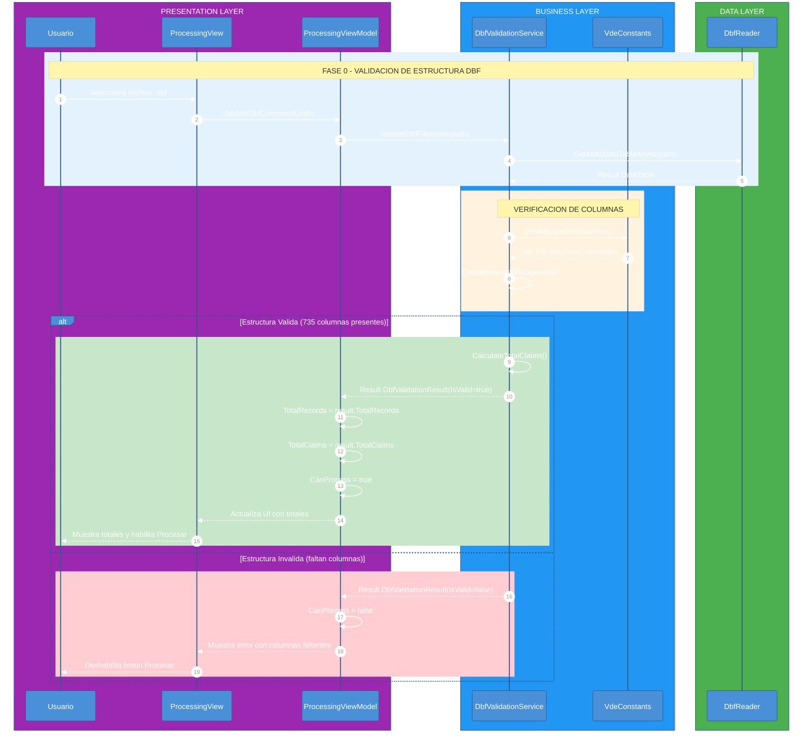
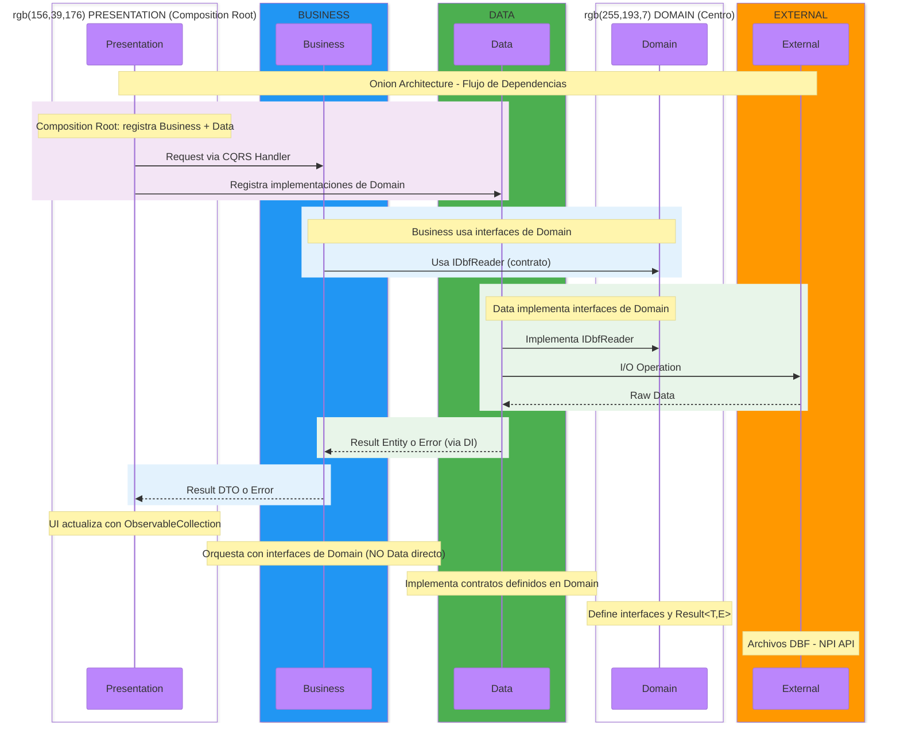

# Diagramas de Flujo de Trabajo - SSS.Quality1500

Este documento contiene los diagramas de secuencia que ilustran el flujo de trabajo principal de la aplicación.

## Flujo Principal de la Aplicación

El siguiente diagrama muestra las 4 fases principales del workflow:
1. **Carga de Archivo** - Lectura de archivos DBF
2. **Validacion** - Ejecucion de reglas de validacion
3. **Revision de Errores** - Correccion interactiva con zoom
4. **Exportacion** - Generacion de reportes


---

## Flujo de Validación de Estructura DBF

Este diagrama muestra el flujo de validación de la estructura del archivo DBF antes de procesar los claims.
La validación verifica que el archivo contenga las 735 columnas esperadas (119 no-service-line + 28 lineas x 22 columnas).



### Componentes del Flujo

| Componente | Capa | Responsabilidad |
|------------|------|-----------------|
| `ProcessingViewModel` | Presentation | Coordina UI y comandos |
| `DbfValidationService` | Business | Valida estructura del DBF |
| `VdeConstants` | Domain | Define las 735 columnas esperadas |
| `DbfReader` | Data | Lee el archivo DBF |

### Resultado de Validación

```csharp
public class DbfValidationResult
{
    public bool IsValid { get; set; }           // True si todas las columnas existen
    public int TotalRecords { get; set; }       // Total de registros (imagenes)
    public int TotalClaims { get; set; }        // Claims (V1PAGINA != "99")
    public List<string> MissingColumns { get; set; }  // Columnas faltantes
    public string? ErrorMessage { get; set; }   // Mensaje de error
}
```

---

## Diagrama de Capas (Onion Architecture)

Este diagrama muestra la arquitectura Onion donde Business y Data son capas hermanas que ambas dependen de Domain:



---

## Flujo del Result Pattern

Este diagrama ilustra como se utiliza el patron `Result<T,E>` para manejar operaciones que pueden fallar:


---

## Leyenda de Colores

| Color | Capa/Fase | Codigo RGB |
|-------|-----------|------------|
| Purpura | Presentation Layer | `rgb(156,39,176)` |
| Azul | Business Layer | `rgb(33,150,243)` |
| Verde | Data Layer | `rgb(76,175,80)` |
| Naranja | External Systems | `rgb(255,152,0)` |
| Azul claro | Fase 1: Carga | `rgb(227,242,253)` |
| Naranja claro | Fase 2: Validacion | `rgb(255,243,224)` |
| Verde claro | Fase 3: Revision | `rgb(232,245,233)` |
| Purpura claro | Fase 4: Exportacion | `rgb(243,229,245)` |
| Verde pastel | Exito / Correccion | `rgb(200,230,201)` |
| Amarillo pastel | Aceptar Error | `rgb(255,245,157)` |
| Rojo pastel | Error / Fallo | `rgb(255,205,210)` |
| Purpura medio | Export Excel | `rgb(225,190,231)` |
| Purpura oscuro | Export PDF | `rgb(206,147,216)` |

---

## Componentes por Capa (Onion Architecture)

### Domain Layer (Centro - Sin dependencias)
- **Entities**: ClaimRecord, PatientInfo, ProviderInfo
- **Value Objects**: Objetos inmutables de dominio
- **Interfaces**: Contratos (IDbfReader, INpiApiClient) implementados por Data
- **Result<T,E>**: Patron para manejo de errores
- **CQRS**: IQueryHandler, ICommandHandler

### Common Layer (Sin dependencias)
- **Utilities**: EnvironmentProvider, VersionInfo
- **Services**: LazyService

### Business Layer (Depende solo de Domain)
- **CQRS Handlers**: ValidateDbfHandler, ProcessClaimsHandler
- **Services**: ValidationEngine (usa interfaces de Domain)
- **Validators**: NpiFormatValidator, DateRangeValidator
- **DTOs**: Objetos de transferencia

### Data Layer (Depende de Domain y Common)
- **Services**: DbfReader (implementa IDbfReader de Domain)
- **ApiClients**: NpiApiClient (implementa INpiApiClient de Domain)
- **Repositories**: Implementaciones de repositorios

### Presentation Layer (Composition Root - Business y Data)
- **Views**: WPF XAML con MaterialDesignThemes
- **ViewModels**: CommunityToolkit.Mvvm con `[ObservableProperty]` y `[RelayCommand]`
- **Services**: NavigationService, DialogService
- **DI Registration**: Registra servicios de Business Y Data

---

## Persistencia de Datos

Esta solucion utiliza **archivos DBF** como unico mecanismo de persistencia:

- **Lectura**: `DbfReader.GetAllAsDataTableAsync(path)`
- **Escritura**: `DbfReader.UpdateRecordAsync(claim)`
- **No se usa**: SQLite, EF Core, ni base de datos local

Los archivos DBF son el formato nativo de los datos de claims CMS-1500.

---

## Referencias

- [PLAN_TRABAJO.md](../PLAN_TRABAJO.md) - Plan de trabajo detallado
- [CLAUDE.md](../CLAUDE.md) - Guia de arquitectura
- [HEALTHCARE_CONTEXT.md](./HEALTHCARE_CONTEXT.md) - Contexto de CMS-1500
- [VALIDATION_RULES.md](./VALIDATION_RULES.md) - Reglas de validacion
